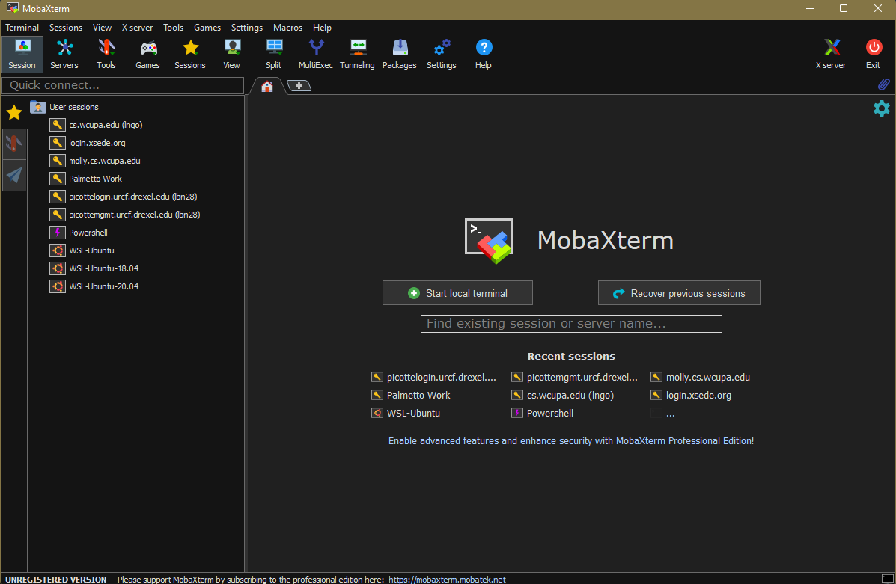
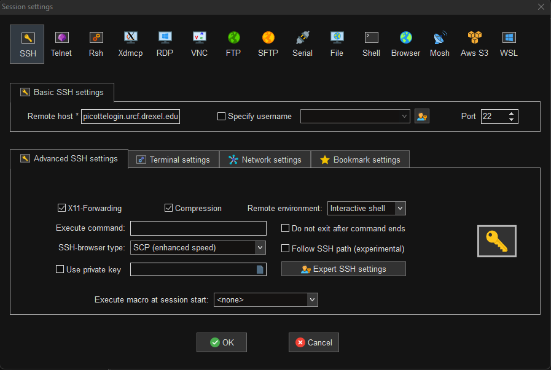
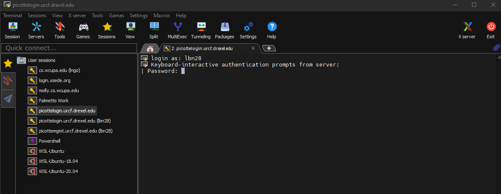
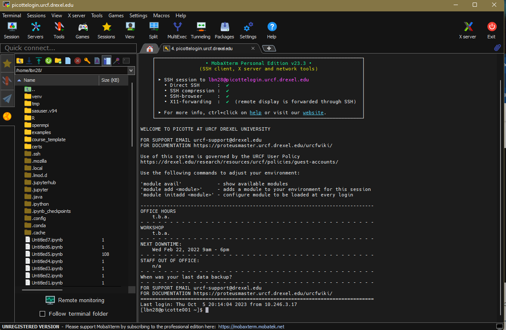

# Accessing the Picotte Cluster

## Remote login (SSH)

To be able to run commands on Palmetto from your own machine, you will first 
need to log in. We will login via **SSH** which will provide us a shell on 
Picotte's login nodes.

For Mac OS X, you can open the Terminal Application
  - Click on the magnifying glass icon on the top right 
  corner of the screen.
  - Start typing `Terminal` in the search box, and the 
  `Terminal` app will appear to be selected. 

~~~bash
ssh <your Picotte username>@picottelogin.urcf.drexel.edu
~~~

For Windows, first you need to download and install
[MobaXterm Home Edition](https://mobaxterm.mobatek.net/download.html).

> It is important that you unzip the downloaded installer prior to installation.
> The zipped installer file contains an additional data file besides the installer
> executable. This data file is not accessible if the installer executable is
> called from insize the zipped file (something Windows allows you to do).

After MobaXterm starts, click the `Session` button.

Select SSH session and use the following parameters (whichever required), then click `OK`:

* Remote host: `picottelogin.urcf.drexel.edu`
* SSH-browser type: Enhanced SCP
* Port: 22

At this stage, for both Mac and Windows, you will be asked to enter your username
and password.
- **When you type in your password, you will not see anything. This is a normal 
security measure, just keep focusing on typing in your password correctly.**

**For MobaXterm, please select No when asked if you want to save your password.**

When logged in, you are presented with a welcome message and the following "prompt", 
with `username` is replaced by your actual Picotte username:

~~~bash
[username@picotte001 ~]$
~~~

Let's enter our first command! 
Type the command `whoami`, then press the Enter key (sometimes marked Return) to send the command to the shell. The command's output is the ID of the current user.

~~~bash
whoami
~~~