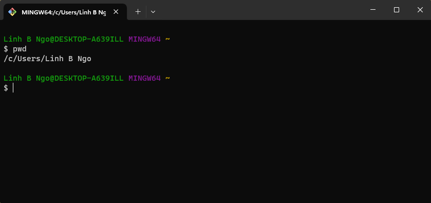
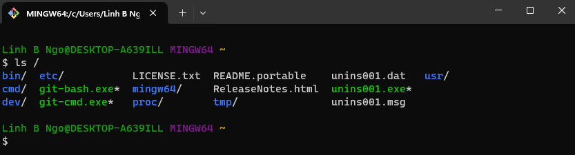
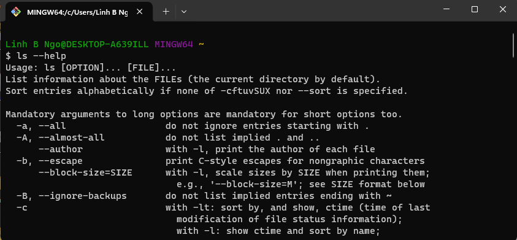

# Navigating Files and Directories


```{admonition} 1. Files and Directories
:class: dropdown

- **File System**: an Operating System component responsible for managing files and directories. 
- Perspective:
  - On a GUI, you click to move from one place to another, so you are *outside* the file system 
  space looking in. 
  - On a CLI, you need to explicitly provide direction (**path**) for the command to know with which 
  file/directory it is supposed to interact. The perspective is more *inside* the file system space. 

```

```{admonition} 2. Where are we, what do we have here, and how do we go somewhere else?
:class: dropdown

- Three basic commands: `pwd`, `ls`, `cd`
- `pwd` returns the absolute path to the current working directory 
(i.e.: where you are when you are in the terminal).

~~~bash
pwd
~~~





- `ls` returns the list of current files and directories in the
target directory. 

~~~bash
ls /
~~~




- There are many options available for different commands. 
To view the documentation, run the followings:

~~~bash
ls --help
~~~



- Run `ls` by itself will list the contents of the current directory. 

~~~bash
ls
~~~

- `cd` allows users to change the current directory (outcome 
of `pwd`) to the target directory. 
  - Run `man cd` or `cd --help` to read the documentation for `cd`. 
  - The generate syntax for `cd` is `cd DESTINATION` with 
  `DESTINATION` can either be absolute or relative paths or special paths. 
- Change to root directory and view contents of root:

~~~bash
cd /
ls 
~~~

- Special paths:
  - `~`: home direcrory
  - `.`: current directory
  - `..`: a directory that is one level above the current directory

- Change to your home directory using the special path
  - Check the content of your home directory to confirm that you have 
  the `shell-lesson-data` directory. 
  - Change into `shell-lesson-data` directory and view the contents of this directory

~~~bash
cd ~
ls Desktop/
cd Desktop/shell-lesson-data
ls 
~~~

```


```{admonition} 3. Challenge: exploring more ls flags
:class: dropdown

- You can also use two options at the same time. What does the command 
`ls` do when used with the `-l` option? What about if you use both the 
`-l` and the `-h` option?
- Some of its output is about properties that we do not cover in this 
lesson (such as file permissions and ownership), but the rest should be 
useful nevertheless.

:::{admonition} Solution
:class: dropdown

- The `-l` option makes `ls` use a long listing format, showing not only 
the file/directory names but also additional information, such as the 
file size and the time of its last modification. 
- If you use both the `-h` option and the `-l` option, this makes the file 
size *human readable*, i.e. displaying something like 5.3K instead of 5369.
:::
```

```{admonition} 4. Challenge: Listing in reverse chronological order
:class: dropdown

- By default, ls lists the contents of a directory in alphabetical 
order by name. The command ls `-t` lists items by time of last change 
instead of alphabetically. The command ls `-r` lists the contents of a 
directory in reverse order. 
- Which file is displayed last when you combine the `-t` and `-r` options? 
Hint: You may need to use the -l option to see the last changed dates.

:::{admonition} Solution
:class: dropdown

The most recently changed file is listed last when using `-rt`. 
This can be very useful for finding your most recent edits or 
checking to see if a new output file was written.
:::
```


```{admonition} 5. Challenge: ls Reading comprehension
:class: dropdown

- Using the filesystem diagram below.
- If `pwd` displays `/Users/backup` and  `-r` tells `ls` to display things in 
reverse order, what command(s) will result in the following output: 

~~~bash
pnas_sub/ pnas_final/ original/
~~~


1. `ls pwd`
2. `ls -r -F`
3. `ls -r -F /Users/backup`

:::{admonition} Solution
:class: dropdown

1. No: `pwd` is not the name of a directory.
2. Yes: `ls` without directory argument lists files and directories in the current directory.
3. Yes: uses the absolute path explicitly.
:::
```


```{admonition} 6. General syntax of a shell command
:class: dropdown


- `ls` is the command, with an option `-F` and an argument `/`. 
- **Option**: 
  - either start with a single dash (`-`) or two dashes (`--`), 
  - change the behavior of a command. 
  - can be referred to as either `switches` or `flags`. 
- **Arguments** tell the command what to operate on (e.g. files and directories). 
- Sometimes `options` and `arguments` are referred to as parameters.
  - The shell is in fact just a process/function and these `options` and `arguments`
  are being passed as parameters to the shell's function that is responsible for 
  executing the **command**. 
- A command can be called with more than one option and more than one argument, but a 
command doesn’t always require an argument or an option.
- Each part is separated by spaces: if you omit the space between `ls` and `-F` the 
shell will look for a command called `ls-F`, which doesn’t exist. 
- Capitalization can be important. 
  - `ls -s` will display the size of files and directories alongside the names
  - `ls -S` will sort the files and directories by size

```

