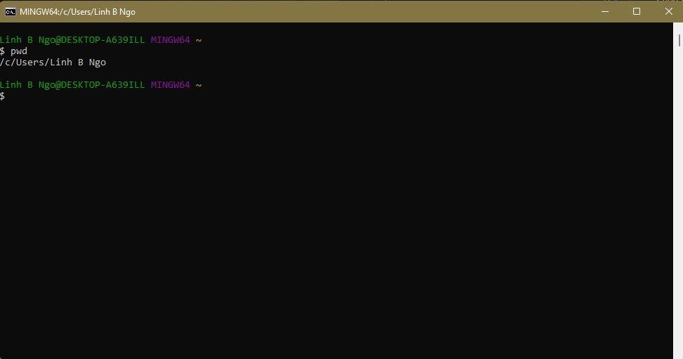
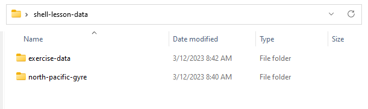
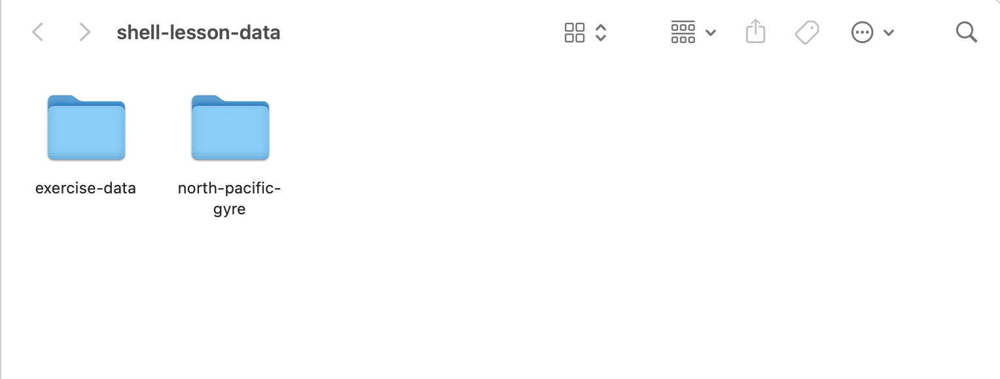

# Introduction to the Unix shell

The workshop provides an introduction to the Unix shell for researchers. It's a
condensed and edited version of [this workshop from Software
Carpentry](https://swcarpentry.github.io/shell-novice/index.html)

The shell lets you automate repetitive tasks and combine smaller tasks
into larger, more powerful workflows. Use of the shell is fundamental to a wide
range of advanced computing tasks, including high-performance computing.

Topics will include the file system, file and directory manipulation, chaining
multiple tools using pipes, and basic scripting.

## Preparation

To do this workshop, you'll need a Unix shell, and to download an example
dataset that we'll be working with. Follow the steps below to make sure you're
ready with both of these.

```{admonition} Get a Unix shell

:::::{tab-set}
::::{tab-item} Windows
Prior to workshop, Windows users should download and install
[Git for Windows](https://gitforwindows.org/). If you already have this installed, it is perhaps
time for an update, as the latest Git for Windows software will have Git Bash integrated
with Windows Terminal.

After running the installer, make sure the following steps are done correctly:
  - `Select Components`: check the **Add a Git Bash Profile to Windows Terminal** box.
  - `Choose the default editor used by Git`: scroll up on the dropdown list
  and choose **User the Nano editor by default**.
  - `Adjusting the name of the initial branch in new repositories`: ensure that
  **Let Git decide** is selected.
  - `Adjusting your PATH environment`: ensure that
  **Git from the command line and also from 3rd-party software** is selected.
  - `Choosing the SSH executable`: select **Use bundled OpenSSH**.
  - `Choosing HTTPS transport backend`: ensure that
  **Use the native Windows Secure Channel Library** is selected.
  - `Configuring the line ending conversion`: ensure that **Checkout Windows-style, commit Unix-style line endings** is selected.
  - `Configuring the terminal emulator to use with Git Bash`: ensure that **Use Windows' default console window** is selected.
  - `Choose the default behavior of 'git pull'`: ensure that **Fast-forward or merge** is selected.
  - `Choose a credential helper`: ensure that "Git Credential Manager" is selected.
  - `Configuring extra options`: check both boxes on **Enable file system caching** and
  **Enable symbolic links**.
  - Do not check any `Configurating experimental options` boxes.
  - Click on "Install".
  = Click on "Finish".

To launch Git Bash, you can launch the Git Bash app directly via Windows Main Menu




You can also launch Git Bash via Windows Terminal. Windows Terminal is a powerful
terminal program intended to replace the older `Command Prompt` and `Power Shell`
launchers. The terminal is available by default with Windows 11. For earlier version,
it can be downloaded and installed via `Windows App Store`. More detailed instructions
can be found at https://learn.microsoft.com/en-us/windows/terminal/install.


::::
::::{tab-item} macOS

For macOS users, the "Terminal" app provides a Unix shell, and is built-in to the operating system, so you don't need to install anything.

Open Spotlight, the macOS search tool, by clicking the magnifying glass icon in the top right corner of your screen. Start typing
"terminal" into the search box. The Terminal app will appear, and you can click on it or press `Enter` to launch it.


::::
:::::

```

```{admonition} Download example data

- Download [the workshop data](https://github.com/URCF/urcf_workshops/raw/master/data/shell-lesson-data.zip)
to your computer's Desktop.
- Unzip the file. You should see the following contents in an unzipped directory called `shell-lesson-data` on
your Desktop.

:::::{tab-set}
::::{tab-item} Windows



::::
::::{tab-item} MacOS



::::
:::::