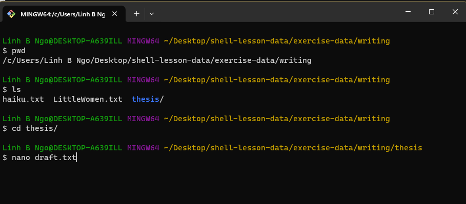
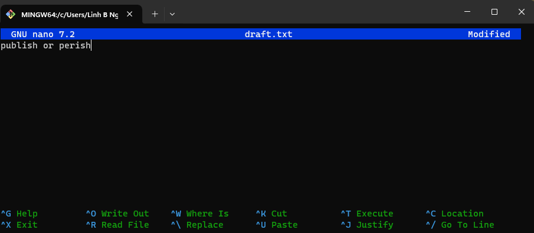
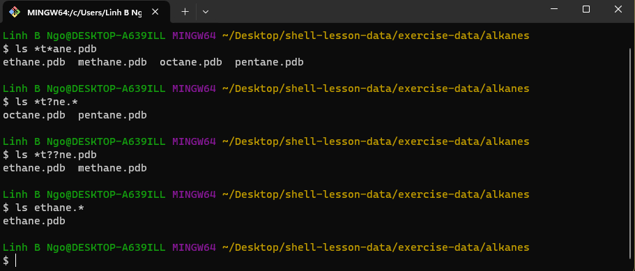

# Working With Files and Directories

```{admonition} 1. Names for Files and Directories
:class: dropdown

Complicated names of files and directories can make your life very painful
when working on the command line. Here we provide a few useful
tips for the names of your files from now on.

1. Don't use whitespaces.
    White spaces can make a name more meaningful
    but since whitespace is used to break arguments on the command line
    is better to avoid them on name of files and directories.
    You can use `-` or `_` instead of whitespace.
    Commands treat names starting with `-` as options.

2. Stay with letters, numbers, `.` (period), `-` (dash) and `_` (underscore).
3. Don't begin the name with `-`.
   
If you need to refer to names of files or directories that have whitespace
or another non-alphanumeric character you should put quotes around the name.

```


```{admonition} 2. Creating directories: mkdir
:class: dropdown

- Create a directory called `thesis`, and check for its existence.
  - Also check that there is nothing inside
  the newly created directory. 

~~~bash
cd ~/shell-lesson-data/exercise-data/writing
mkdir thesis
ls -F
~~~

- **Important for directory and file names in Linux!!!**
  - Do not use spaces/special characters in file and directory names. 
  - Use `-`, `_`, and `.` for annotation, but do not begin
  the names with them. 

```


```{admonition} 3. Challenge: mkdir creating multiple directories
:class: dropdown

- What is the role of the `-p` flag in the following 
commands:

~~~bash
mkdir ../project/data 
ls -F ../project
mkdir -p ../project/data
mkdir -p ../project/report ../project/results
ls -F ../project
~~~

:::{admonition} Solution
`-p` allows the creation of all directories
on the specified path, regardless whether any directory on 
that path exists. 
:::
```


```{admonition} 4. Creating files: nano (or vim)
:class: dropdown

- Linux terminal environment is text-only, hence its editors are 
text only as well. 
  - `nano`
  - `vim`
  - `emacs`. 
- Fun read: [One does not simply exist vim](https://stackoverflow.blog/2017/05/23/stack-overflow-helping-one-million-developers-exit-vim/)
- We are using nano (lowest learning curve). 
- Create a file named `draft.txt` inside `thesis`. 
  - Type in the contents shown in the screenshot. 

~~~
pwd
ls
cd thesis
nano draft.txt
~~~



Enter the text as shown in the screenshot below




- To save the text, you need to press `Ctrl` + `O` keys:
  - Press and hold `Ctrl` then press `O`. 
  - You will be asked whether to keep the same file name or to edit the name. 
  Press `Enter` to confirm. 
- To quit nano, press `Ctrl` + `X`. 
  - If you have not saved the text before, nano will ask 
  if you want to save the file first and confirm the name with `Y` or `N`. 

```


```{admonition} 5. Moving files and directories:  mv
:class: dropdown

- `mv` is short for move. It will move a file/directory from 
one location to another. 

~~~bash
cd ~/shell-lesson-data/exercise-data/writing
ls thesis
mv thesis/draft.txt thesis/quotes.txt
ls thesis
mv thesis/quotes.txt .
ls thesis
ls 
~~~

```


```{admonition} 6. Challenge: Moving files to a new folder
:class: dropdown

- After running the following commands, Jamie realizes that she 
put the files `sucrose.dat` and `maltose.dat` into the wrong folder. The 
files should have been placed in the `raw` folder.

~~~bash
$ ls -F
analyzed/ raw/
$ ls -F analyzed
fructose.dat glucose.dat maltose.dat sucrose.dat
$ cd analyzed
~~~


- Fill in the blanks to move these files to the `raw` folder:

~~~bash
$ mv sucrose.data maltose.data ____/_____
~~~

:::{admonition} Solution
~~~
$ mv sucrose.data maltose.data ../raw
~~~
:::
```


```{admonition} 7. Copying files and directories: cp
:class: dropdown

- `cp` stands for copy. It copies a file or directory to a new location, 
possibly with a new name.  

~~~bash
$ cp quotes.txt thesis/quotations.txt
$ ls quotes.txt thesis/quotations.txt
$ cp -r thesis thesis_backup
$ ls thesis thesis_backup
~~~

```


```{admonition} 8. Challenge: Renaming files
:class: dropdown

- Suppose that you created a plain-text file in your 
current directory to contain a list of the statistical 
tests you will need to do to analyze your data, and named 
it: `statstics.txt`
- After creating and saving this file you realize you 
misspelled the filename! You want to correct the mistake, 
which of the following commands could you use to do so?

1. cp statstics.txt statistics.txt
2. mv statstics.txt statistics.txt
3. mv statstics.txt .
4. cp statstics.txt .

:::{admonition} Solution
1. No. While this would create a file with the correct name, 
the incorrectly named file still exists in the directory and 
would need to be deleted.
2. Yes, this would work to rename the file.
3. No, the period(.) indicates where to move the file, but 
does not provide a new file name; identical file names cannot be created.
4. No, the period(.) indicates where to copy the file, but does 
not provide a new file name; identical file names cannot be created.
:::
```


```{admonition} 9. Challenge: Moving and copying
:class: dropdown

- What is the output of the last `ls` command in the sequence shown below?

~~~bash
$ pwd
/home/rammy/data
$ ls
proteins.dat
$ mkdir recombined
$ mv proteins.dat recombined/
$ cp recombined/proteins.dat ../proteins-saved.dat
$ ls
~~~


1. proteins-saved.dat recombined
2. recombined
3. proteins.dat recombined
4. proteins-saved.dat

:::{admonition} Solution
1. No, `proteins-saved.dat` is located at `/home/rammy/`
2. Yes
3. `proteins.dat` is located at `/home/rammy/data/recombined`
4. No, `proteins-saved.dat` is located at `/home/rammy/`
:::
```


```{admonition} 10. Removing files and directories: rm
:class: dropdown

- Returning to the `shell-lesson-data/exercise-data/writing` directory, 
let’s tidy up this directory by removing the quotes.txt file we created. 
- The command we’ll use for this is `rm` (short for *remove*): 

~~~bash
$ cd ~/shell-lesson-data/exercise-data/writing
$ ls 
$ rm quotes.txt
$ ls quotes.txt
$ rm thesis
$ rm -r thesis
~~~

```
 

```{admonition} 11. Wildcards
:class: dropdown

- `*` is a wildcard, which matches zero or more characters. 
  - Inside `shell-lesson-data/exercise-data/alkanes` directory: 
    - `*.pdb` matches `ethane.pdb`, `propane.pdb`, and every file that ends with ‘.pdb’. 
    - `p*.pdb` only matches `pentane.pdb` and `propane.pdb`, because the ‘p’ at the front 
    only matches filenames that begin with the letter ‘p’.
- `?` is also a wildcard, but it matches exactly one character. So 
  - `?ethane.pdb` would match `methane.pdb`
  - `*ethane.pdb` matches both `ethane.pdb`, and `methane.pdb`.
- Wildcards can be used in combination with each other
  - `???ane.pdb` matches three characters followed by `ane.pdb`.
  - `cubane.pdb`, `ethane.pdb`, `octane.pdb`.
- When the shell sees a wildcard, it expands the wildcard to create a list of 
matching filenames before running the command that was asked for. It is the shell, 
not the other programs, that deals with expanding wildcards.
- Change into `shell-lesson-data/exercise-data/alkanes` and try the following 
commands

~~~bash
$ ls *t*ane.pdb
$ ls *t?ne.*
$ ls *t??ne.pdb
$ ls ethane.*
~~~



```


```{admonition} 12. Challenge: more on wildcards
:class: dropdown

Sam has a directory containing calibration data, datasets, and descriptions of
the datasets:

~~~bash
.
├── 2015-10-23-calibration.txt
├── 2015-10-23-dataset1.txt
├── 2015-10-23-dataset2.txt
├── 2015-10-23-dataset_overview.txt
├── 2015-10-26-calibration.txt
├── 2015-10-26-dataset1.txt
├── 2015-10-26-dataset2.txt
├── 2015-10-26-dataset_overview.txt
├── 2015-11-23-calibration.txt
├── 2015-11-23-dataset1.txt
├── 2015-11-23-dataset2.txt
├── 2015-11-23-dataset_overview.txt
├── backup
│   ├── calibration
│   └── datasets
└── send_to_bob
    ├── all_datasets_created_on_a_23rd
    └── all_november_files
~~~


Before heading off to another field trip, Sam wants to back up her data and
send datasets created the 23rd of any month to Bob. Sam uses the following commands
to get the job done:

~~~bash
$ cp *dataset* backup/datasets
$ cp ____calibration____ backup/calibration
$ cp 2015-____-____ send_to_bob/all_november_files/
$ cp ____ send_to_bob/all_datasets_created_on_a_23rd/
~~~

Help Sam by filling in the blanks.

The resulting directory structure should look like this

~~~bash
.
├── 2015-10-23-calibration.txt
├── 2015-10-23-dataset1.txt
├── 2015-10-23-dataset2.txt
├── 2015-10-23-dataset_overview.txt
├── 2015-10-26-calibration.txt
├── 2015-10-26-dataset1.txt
├── 2015-10-26-dataset2.txt
├── 2015-10-26-dataset_overview.txt
├── 2015-11-23-calibration.txt
├── 2015-11-23-dataset1.txt
├── 2015-11-23-dataset2.txt
├── 2015-11-23-dataset_overview.txt
├── backup
│   ├── calibration
│   │   ├── 2015-10-23-calibration.txt
│   │   ├── 2015-10-26-calibration.txt
│   │   └── 2015-11-23-calibration.txt
│   └── datasets
│       ├── 2015-10-23-dataset1.txt
│       ├── 2015-10-23-dataset2.txt
│       ├── 2015-10-23-dataset_overview.txt
│       ├── 2015-10-26-dataset1.txt
│       ├── 2015-10-26-dataset2.txt
│       ├── 2015-10-26-dataset_overview.txt
│       ├── 2015-11-23-dataset1.txt
│       ├── 2015-11-23-dataset2.txt
│       └── 2015-11-23-dataset_overview.txt
└── send_to_bob
    ├── all_datasets_created_on_a_23rd
    │   ├── 2015-10-23-dataset1.txt
    │   ├── 2015-10-23-dataset2.txt
    │   ├── 2015-10-23-dataset_overview.txt
    │   ├── 2015-11-23-dataset1.txt
    │   ├── 2015-11-23-dataset2.txt
    │   └── 2015-11-23-dataset_overview.txt
    └── all_november_files
        ├── 2015-11-23-calibration.txt
        ├── 2015-11-23-dataset1.txt
        ├── 2015-11-23-dataset2.txt
        └── 2015-11-23-dataset_overview.txt
~~~


:::{admonition} Solution
~~~
$ cp *calibration.txt backup/calibration
$ cp 2015-11-* send_to_bob/all_november_files/
$ cp *-23-dataset* send_to_bob/all_datasets_created_on_a_23rd/
~~~
:::
```
