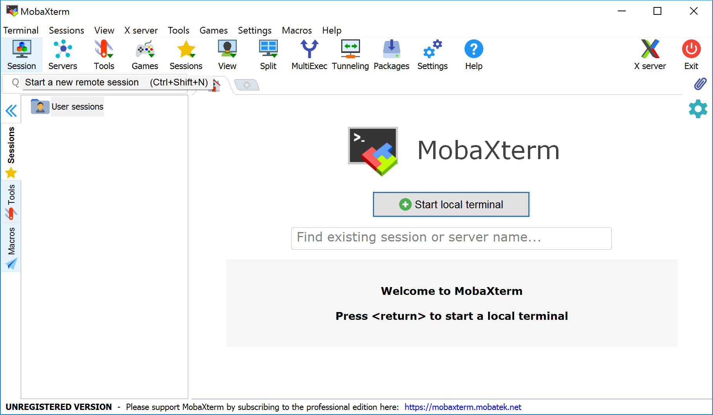

# Accessing the Palmetto Cluster
teaching: 15
exercises: 0
questions:
- "How can I access the Palmetto cluster from my local machine?"
objectives:
- SSH client, Terminal, MobaXTerm
keypoints:
- "Palmetto can be accessed by an SSh (secure shell) client"
- "Windows user can use `MobaXTerm` application"
- "Mac users can use the `Terminal` application"

Pametto is accessed using the SSH (["Secure shell"](https://en.wikipedia.org/wiki/Ssh_(Secure_Shell))) protocol. Palmetto runs the *SSH server*; on your local machine, you will need to run *SSH client* which connects to a server using a command-line *terminal*. The commands that are entered on the terminal are processed by the server on Palmetto.

To start the SSH client on a Mac, you can open the Terminal Application (which is usually located in `Applications` &rarr; `Utilities`) and run the following:

~~~
ssh login.palmetto.clemson.edu
~~~
{: .bash}

For Windows, first you need to download and install
[MobaXterm Home Edition](https://mobaxterm.mobatek.net/download.html).

> It is important that you unzip the downloaded installer prior to installation.
> The zipped installer file contains an additional data file besides the installer
> executable. This data file is not accessible if the installer executable is
> called from inside the zipped file (something Windows allows you to do).
{: .callout}

After MobaXterm starts, click the `Session` button.

Select SSH session and use the following parameters (whichever required), then click `OK`:

* Remote host: `login.palmetto.clemson.edu`
* SSH-browser type: Enhanced SCP
* Port: 22

At this stage, for both Mac and Windows, you will be asked to enter your username
and password, then DUO option.

When logged in,
you are presented with a welcome message
and the following "prompt":

~~~
[username@login001 ~]$
~~~
{: .bash}

The prompt in a bash shell usually
contains a (`$`) sign,
and shows that the shell is waiting for input.
The prompt may also contain other information:
this prompt tells you `your username` and which node
you are connected to -
`login001` is the "login" node.
It also tells you your current directory,
i.e., `~`, which, as you will learn shortly,
is short for your *home* directory.

In the figure below, MobaXterm also gives you a GUI browser of your home
directory on Palmetto. For Mac OS and Linux terminal, you will only have the
command line interface to the right.

