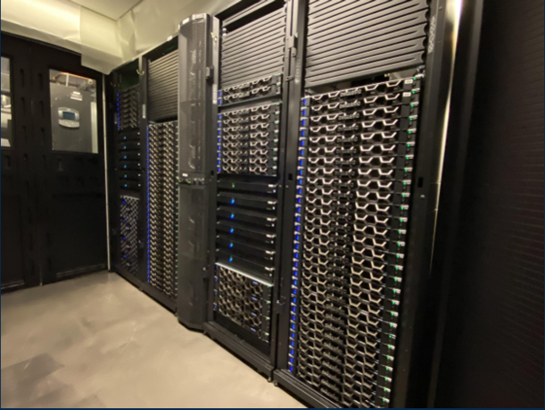
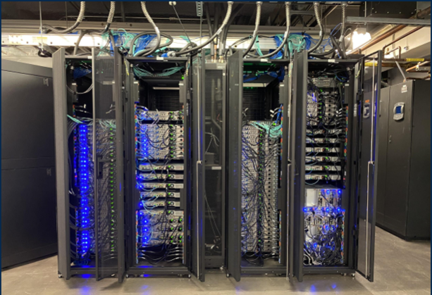

# Introduction

Picotte is a *supercomputing cluster*: a set of powerful computers that are connected 
to each other. It is built and maintained by Drexel University, and is located at 
Curtis 358, the former rifle range of Drexel University.

