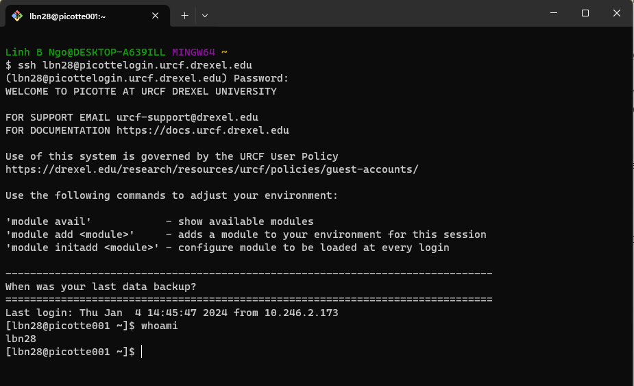

# Accessing the Picotte Cluster

## Remote login (SSH)

To be able to run commands on Picotte from your own machine, you will first 
need to log in. We will login via **SSH** which will provide us a shell on 
Picotte's login nodes.

- For Mac OS X, you can open the Terminal Application. 
- For Windows, you can launch either the Git Bash app or its integration 
through Windows Terminal. 
- Type the following into your terminal. 
  - `YOUR_PICOTTE_USERNAME` is your Drexel username (without the `@drexel.edu`)

~~~bash
ssh YOUR_PICOTTE_USERNAME@picottelogin.urcf.drexel.edu
~~~

When logged in, you are presented with a welcome message and the following "prompt", 
with `username` is replaced by your actual Picotte username:

~~~bash
[username@picotte001 ~]$
~~~

Let's enter our first command! 
Type the command `whoami`, then press the Enter key (sometimes marked Return) to send the command to the shell. The command's output is the ID of the current user.

~~~bash
whoami
~~~

:::::{tab-set}
::::{tab-item} Windows

::::
::::{tab-item} MacOS

::::
:::::