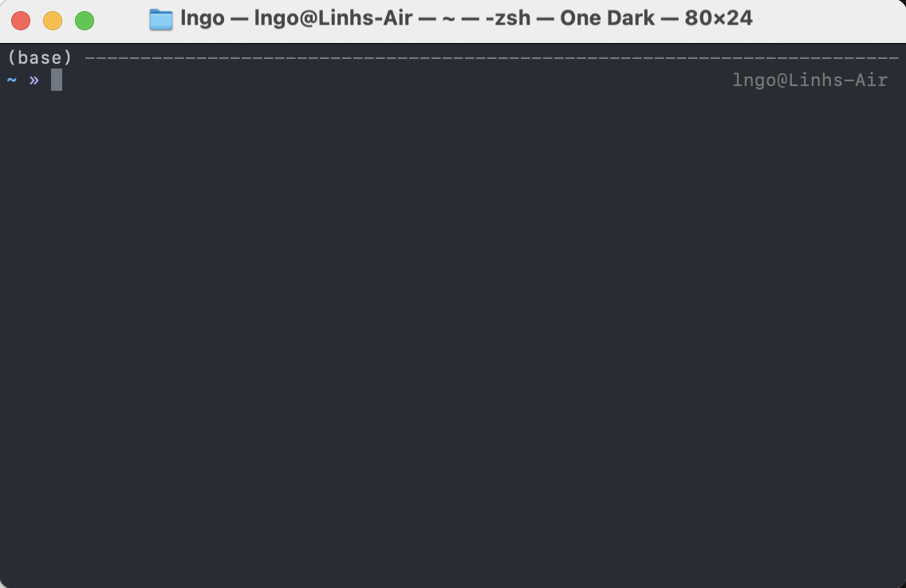

# Introduction to Research Computing on Picotte

- **Instructor**: Linh B. Ngo
- **Email**: lbn28 AT drexel DOT edu

## Workshop Description

In this workshop, participants are introduced to the Picotte Cluster, Drexel University's 
high-performance computing resource. We will go over Picotte's structure, its basic usage, and 
how to submit computational tasks to the cluster.

## Prerequisites

Participants should check and complete the following steps prior to the workshop.

:::::{tab-set}
::::{tab-item} Windows
Prior to workshop, Windows users should download and install 
[Git for Windows](https://gitforwindows.org/). If you already have this installed, it is perhaps 
time for an update, as the latest Git for Windows software will have Git Bash integrated 
with Windows Terminal. 

After running the installer, make sure the following steps are done correctly:
  - `Select Components`: check the **Add a Git Bash Profile to Windows Terminal** box. 
  - `Choose the default editor used by Git`: scroll up on the dropdown list 
  and choose **User the Nano editor by default**.  
  - `Adjusting the name of the initial branch in new repositories`: ensure that 
  **Let Git decide** is selected. 
  - `Adjusting your PATH environment`: ensure that 
  **Git from the command line and also from 3rd-party software** is selected. 
  - `Choosing the SSH executable`: select **Use bundled OpenSSH**.
  - `Choosing HTTPS transport backend`: ensure that 
  **Use the native Windows Secure Channel Library** is selected.
  - `Configuring the line ending conversion`: ensure that **Checkout Windows-style, commit Unix-style line endings** is selected.
  - `Configuring the terminal emulator to use with Git Bash`: ensure that **Use Windows' default console window** is selected.
  - `Choose the default behavior of 'git pull'`: ensure that **Fast-forward or merge** is selected.
  - `Choose a credential helper`: ensure that "Git Credential Manager" is selected.
  - `Configuring extra options`: check both boxes on **Enable file system caching** and 
  **Enable symbolic links**. 
  - Do not check any `Configurating experimental options` boxes. 
  - Click on "Install".
  = Click on "Finish".

To launch Git Bash, you can launch the Git Bash app directly via Windows Main Menu

You can also launch Git Bash via Windows Terminal. Windows Terminal is a powerful 
terminal program intended to replace the older `Command Prompt` and `Power Shell`
launchers. The terminal is available by default with Windows 11. For earlier version, 
it can be downloaded and installed via `Windows App Store`. More detailed instructions 
can be found at https://learn.microsoft.com/en-us/windows/terminal/install.

::::
::::{tab-item} MacOS

For Mac users, you can find your Linux-based terminal app by click the search icon (magnifying 
glass icon in the top right corner of your screen) to open the search box and start typing 
`terminal` into the box. The Terminal app will show up, and you can launch the app directly. 

::::
:::::