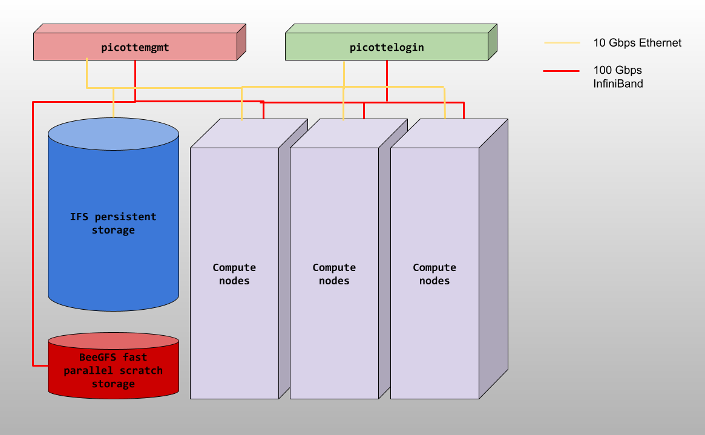

# The structure of the Picotte Cluster

The computers that make up the Picotte cluster are called *nodes*. Most of the 
nodes on Picotte are *compute nodes*, that can perform fast calculations on large 
amounts of data. There is also a special node called the *login node*; it runs 
the server, which works like the interface between the cluster and the outside 
world. The people with Picotte accounts can log into the server by running a 
client (such as `ssh`) on their local machines. 

Our client program passes our login credentials to this server, and if we are allowed 
to log in, the server runs a shell for us. Any commands that we enter into this shell 
are executed not by our own machines, but by the login node.

**DO NOT RUN WORK ON PICOTTE LOGIN (PICOTTE001)**

Another special node is the *scheduler*; Picotte users can get from the
login node to the compute nodes by submitting a request to the scheduler, 
and the scheduler will assign them to the most appropriate compute node.
Picotte also has a few so-called "service" nodes, which serve special purposes 
like transferring code and data to and from the cluster, and hosting web applications.

Picotte hardware includes the followings:

- 74 standard compute nodes:
  - Dell PowerEdge R640 servers	Intel® Xeon® Platinum 8268 CPUs 
  - 48 cores/server
  - 192 GB RAM/server.
- 2 large memory nodes: 
  - Dell PowerEdge R640 servers	Intel® Xeon® Platinum 8268 CPUs 
  - 48 cores/server
  - 1.5 TB RAM/server
- 12 graphical processing unit nodes	
  - Dell PowerEdge C4140 servers	Intel® Xeon® Platinum 8260 CPUs 
  - 48 cores/server
  - 4 Nvidia Tesla V100-SXM2 32GB GPU devices/server
  - 192 GB RAM/server

 