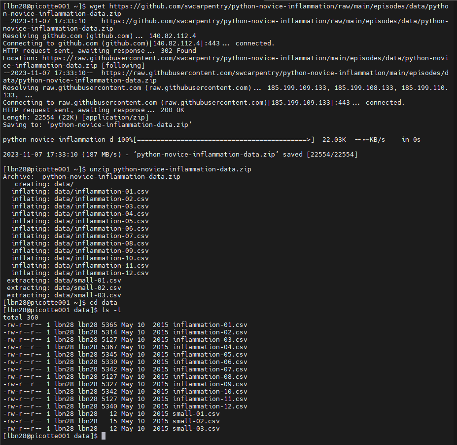
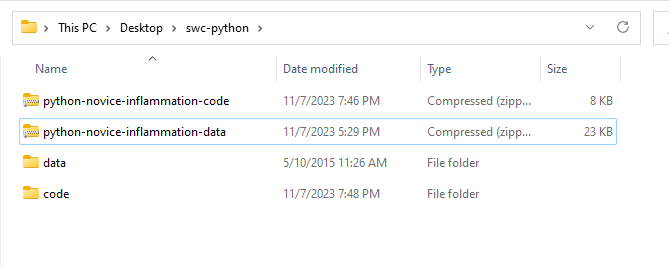
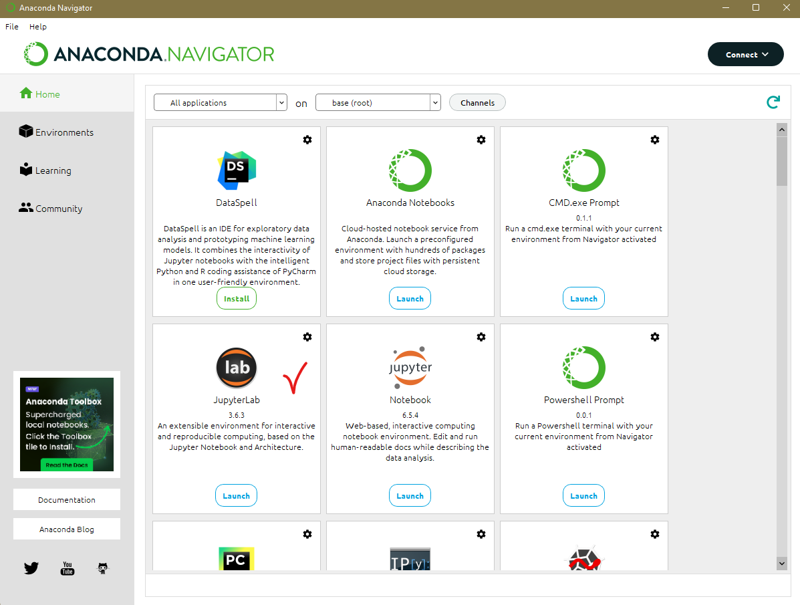
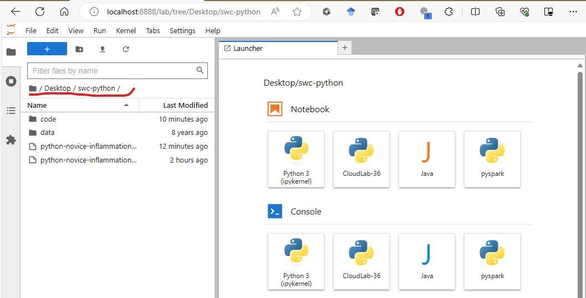

# Introduction to Python Programming

- **Instructor**: Linh B. Ngo
- **Office**: 358 Curtis Hall
- **Email**: lbn28 AT drexel DOT edu

## Workshop Description

This Workshop will introduce Python for those that have little to no 
programming experience and consists of two parts:

-	Part 1: A quick introduction to Python and its basic data analytic 
capability in processing and visualizing data.
-	Part 2: A more in-depth view into programming concepts in Python, 
including loops, conditions, functions, and testing and debugging.

The workshop uses materials from [Software Carpentry](https://software-carpentry.org/)'s 
Programming with Python lesson. 

## Prerequisites

No prerequisites are required

## Software Setup on Picotte

- Require valid Picotte's account.
- You can follow [Picotte's JupyterHub](https://docs.urcf.drexel.edu/software/jupyterhub/jupyterhub/) 
instructions to launch a Jupyter Server on Picotte's compute nodes. 
- For the workshop, the following parameters should be used:
  - `Account`: `urcfprj`
  - `Partition`: def-sm
  - `CPU(s)`: 2
  - `Memory(in GB)`: 4
  - `Wall Time (in hours)`: 4
- Open a terminal from inside JupyterHub and run the following command to 
get the data. 

~~~bash
cd
mkdir swc-python
cd swc-python
wget https://swcarpentry.github.io/python-novice-inflammation/data/python-novice-inflammation-data.zip
wget https://swcarpentry.github.io/python-novice-inflammation/files/code/python-novice-inflammation-code.zip
unzip python-novice-inflammation-data.zip
unzip python-novice-inflammation-code.zip
ls data/
ls code/ 
~~~




## Software Setup on PC (Laptop or Desktop)

```{admonition} Windows
:class: dropdown

- Open `https://www.anaconda.com/products/individual#download-section` with your web browser.
- Download the Anaconda for Windows installer with Python 3. (If you are not sure which 
version to choose, you probably want the 64-bit Graphical Installer *Anaconda3-...-Windows-x86_64.exe*)
- Install `Python 3`` by running the Anaconda Installer, using all of the defaults for installation except make sure to check **Add Anaconda to my PATH environment variable**.

```

```{admonition} MacOS
:class: dropdown

- Open `https://www.anaconda.com/products/individual#download-section` with your web browser.
- Download the Anaconda Installer with Python 3 for macOS (you can either use the Graphical or 
the Command Line Installer).
- Install Python 3 by running the Anaconda Installer using all of the defaults for installation.

```

```{admonition} Linux
:class: dropdown

- Open `https://www.anaconda.com/products/individual#download-section` with your web browser.
- Download the Anaconda Installer with Python 3 for Linux. The installation requires using the shell.
- Open a terminal window and navigate to the directory where the executable is downloaded 
(e.g., `cd ~/Downloads`).
- Type `bash Anaconda3` and then press `Tab` to autocomplete the full file name. The name of 
file you just downloaded should appear.
- Press `Enter` (or `Return` depending on your keyboard). You will follow the text-only prompts. 
  - To move through the text, press `Spacebar`. 
  - Type yes and press `Enter` (or `Return`) to approve the license. 
  - Press `Enter` (or `Return`) to approve the default location for the files. 
  - Type `yes` and press `Enter` (or `Return`) to prepend Anaconda to your `PATH` 
  (this makes the Anaconda distribution the default Python).
  - Close the terminal window.

```

```{admonition} Data preparation

- Create a directory on your Desktop called `swc-python`. Download the following files 
into the `swc-python` directory: 
  - [zipped data file](https://swcarpentry.github.io/python-novice-inflammation/data/python-novice-inflammation-data.zip)
  - [zipped code file](https://swcarpentry.github.io/python-novice-inflammation/files/code/python-novice-inflammation-code.zip)
- Go to `swc-python` and unzip these two files. You should see the two directories: `data` and 
`code` created. 

```



```{admonition} Launch Jupyter Notebook (Step 1)

- Launch Anaconda Navigator
  - On Windows, type Anaconda Navigator into the Search Bar and launch the app
  - On Mac, type Anaconda Navigator into the search box (magnifying glass on 
  top right corner) and launch the app. 
- Launch JupyterLab 

```



```{admonition} Launch Jupyter Notebook (Step 2)

- By default, Jupyter Notebook will launch inside your Document folder (Windows), 
or inside your home directory (MacOS). 
- You can see the Desktop directory. 
- Double-click to get into Desktop, then into `swc-python`. You should see the 
`data` and `code` directores ready. 
```


